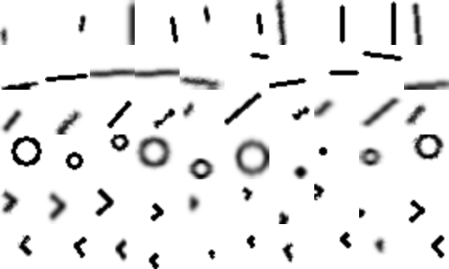

GeoSet
----------------------
GeoSet is a 2D Geometrical Dataset framework.

The main of this framework is to enable the creation of different 2D geometrical datasets extending simple polygons' generation.

The target audience is mainly towards to Machine Leaning Researchers and Enthusiasts since it's extensible and generates ready to use Datasets. 

## Features
* ``2D Shapes as Lines, Open Triangles, Squares, Ellipses``
* ``Augmentation via GLSL Shaders``
* ``Parallel/Threaded generation``
* ``Numpy .npz output (with train/test split)``
* ``Thumbnails sample generation``

## Dependencies
* python 3.x
* cv 2
* moderngl
* PIL
* progress
* colour

## How it works

The framework generates (by default) fill-free Grey-scaled images (black edges on white background) of any size.

The generation of the geometries occurs procedurally and randomly (as bias-free as we can be) according the specified parameters.

Finally, the frameworks enables the addition of augmentations such as blur, noise, etc in order to avoid a sterile dataset.

Below you can find a sample data-set generated by the framework (more [here](documentation/images/datasets)):


## Todo
- [x] Add examples
- [ ] Finalize unit tests
- [ ] Add code comments and inline license
- [ ] Make it easier to extend the procedural generation
- [ ] Make it available on pip

## Quickstart

You first need to create a Dataset by extending the [Dataset](geoset/dataset/dataset.py) class and overriding the `_generate_image` method as in [simple_dataset.py](examples/simple_dataset.py).

After that you only need to run the dataset a in: 
```python
# here you are instantiating the dataset
dataset = SimpleDataset(samples_per_category=10, image_size=(28, 28), destination="output", save_images=False)

# the line below will generate the dataset in-memory
# this operation might take a while depending on your settings
# a visual progress-bar will present the progress
dataset.generate()

# after the dataset is generated you might choose to save the npz file of it 
dataset.save_npz(test_size=.3, file_name='%(name)s_dataset')

# finally if you wish you might choose to save a sample of the thumbnails to publish in your paper 
dataset.save_thumbnails(examples_per_category= 10, scale= 1.0, file_name= '%(name)s_thumbnails')
```

More examples can be found [here](examples)


## Citation
If you intend to publish a paper don't forget to cite the dataset:
```
@misc{ghesla-silvestrim-02192021,
	author = {Ghesla Silvestrim, FGS},
	title = {{GeoSet}},
	url = {https://github.com/fsilvestrim/geoset},
	year = {02.19.2021},
}
```

## License
[GNU GPL-3.0 License](LICENSE)

